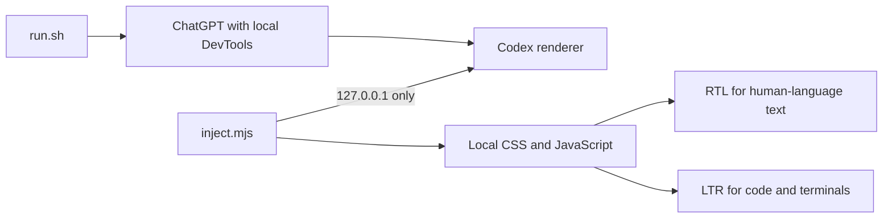

# Local RTL Support for Codex in ChatGPT on macOS

Codex RTL Helper is a local macOS utility that fixes Hebrew and Arabic text direction in Codex without modifying ChatGPT files or sending conversation content to an external service.

> **Important:** This is a temporary, unofficial workaround. It is not affiliated with or supported by OpenAI. A ChatGPT update may change the interface and require an update to this tool.

## Codex RTL Helper menu bar app

The recommended option is the native `Codex RTL Helper` menu bar app. It runs the local RTL mechanism without a Terminal window, shows the connection state, and asks for confirmation before restarting ChatGPT.

Clone the repository:

```sh
git clone https://github.com/ran1904/codex-rtl-macos.git
cd codex-rtl-macos
```

Build and test the app:

```sh
sh ./scripts/test.sh
sh ./scripts/build-app.sh
```

The built app is available at `dist/Codex RTL Helper.app`. Installation in your personal Applications folder is a separate step:

```sh
sh ./scripts/install-app.sh
```

On first launch, Codex RTL Helper opens ChatGPT with a local connection and applies RTL if ChatGPT is closed. If ChatGPT is already running normally, the menu bar icon indicates that a restart is required. Codex RTL Helper never closes ChatGPT without explicit confirmation.

After installation, daily use does not require Terminal. Launch `Codex RTL Helper` from `~/Applications`, then use its menu bar icon.

The tool is particularly useful for technical answers that mix Hebrew or Arabic with English library names, file paths, terminal commands, and code.

## Features

- Detects direction independently for paragraphs, headings, list items, blockquotes, and table cells.
- Aligns Hebrew and Arabic text to the right and uses `unicode-bidi: plaintext` to preserve the order of English, numbers, and punctuation inside RTL text.
- Keeps code blocks, inline code, commands, paths, diffs, terminals, and code editors LTR.
- Adjusts the composer direction while you type.
- Adds an accessible **Auto**, **RTL**, or **LTR** direction control to each message.
- Observes DOM changes so formatting is applied while a response is streaming.

Codex RTL Helper changes only the presentation layer of the active window. It does not alter messages, responses, prompts, conversation files, or the ChatGPT app bundle.

## Requirements

- macOS 13 or later
- ChatGPT installed at `/Applications/ChatGPT.app`
- Xcode developer tools with Swift 6 to build the menu bar app
- Node.js 22 or later for tests and the legacy script-based launcher

Check the installed Node.js version:

```sh
node --version
```

## Quick start

1. Open `Codex RTL Helper` from `~/Applications`.
2. If Codex is closed, Codex RTL Helper opens it automatically with RTL support.
3. If Codex is already open, click the menu bar icon and choose **Restart with RTL…**.
4. Save any unsent draft, then confirm the restart.

## Legacy script-based launcher

The native menu bar app is recommended. The legacy launcher remains available for development and troubleshooting:

1. Quit ChatGPT completely. The launcher does **not** close it for you.
2. Open the project directory:

   ```sh
   cd "/path/to/codex-rtl-macos"
   ```

3. Start the launcher:

   ```sh
   sh ./start.sh
   ```

4. ChatGPT reopens. Open a Codex conversation and continue working normally.
5. Keep the Terminal window open. The launcher reapplies the RTL layer if the Codex renderer reloads.

When finished, stop the launcher with `Ctrl+C`, quit ChatGPT, and reopen it normally. This removes the local RTL layer and closes the DevTools endpoint.

## How it works



`run.sh` starts ChatGPT with Chrome DevTools Protocol restricted to `127.0.0.1`. `inject.mjs` then finds only pages titled `Codex`, connects through a local WebSocket, and applies the presentation layer.

The injector rejects non-loopback targets and WebSocket URLs that use a different port. If it cannot identify a Codex renderer, it fails closed instead of injecting into an unknown page.

## Privacy and security

### What the tool does not do

- It makes no external network requests.
- It does not use a model API, so it has no token cost.
- It stores no analytics, telemetry, tokens, cookies, secrets, or conversation content.
- It does not modify `/Applications/ChatGPT.app`, patch `app.asar`, or change the ChatGPT signature.
- It installs no browser extension or npm package.

### Local DevTools risk

While ChatGPT is open through Codex RTL Helper, a local DevTools endpoint is active. It is bound only to `127.0.0.1`, so another computer on the network cannot access it. However, another process running under the same local user could theoretically connect to it and control the renderer.

Use Codex RTL Helper only on a computer you trust. Do not leave ChatGPT running through Codex RTL Helper when it is not needed. Quit ChatGPT and reopen it normally when you finish.

See [SECURITY.md](SECURITY.md) for the reporting process and the security boundary.

## Performance and response behavior

Codex RTL Helper does not change the model, response content, or token usage. Its only runtime cost is local:

- A small amount of additional CPU and memory for `MutationObserver` and newly changed text blocks.
- A short visual delay may occur in very long conversations or quickly streaming responses.
- A ChatGPT update may change the DOM structure and require selector updates.

Copying code or text preserves the original content. Direction is applied with DOM attributes and CSS, not by adding directional characters to the text.

## Tests

Run the complete test suite:

```sh
sh ./scripts/test.sh
node self-test.mjs
node integration-test.mjs
node inject.mjs --dry-run
sh ./scripts/build-app.sh
```

Additional non-destructive checks:

```sh
node --check inject.mjs
node --check src/direction.js
node --check src/rtl-runtime.js
sh -n run.sh
sh -n start.sh
sh -n stop.sh
sh -n uninstall.sh
sh ./stop.sh --dry-run
sh ./uninstall.sh --dry-run
```

`self-test.mjs` checks RTL/LTR classification, the absence of external endpoints, and the absence of operations that modify ChatGPT.

`integration-test.mjs` starts a mock local DevTools target and verifies that the injector sends `Runtime.evaluate` with the complete RTL layer.

## Troubleshooting

### ChatGPT is already running

Quit all ChatGPT windows and try again. The launcher refuses to start a second instance because an existing instance may not have the required DevTools flags.

### No Codex renderer was found

Start Codex RTL Helper, open a Codex conversation, and wait a few seconds. If the renderer is still missing, a ChatGPT update may have changed the window title or app structure.

### A message has the wrong direction

Use the control shown on the message to choose RTL or LTR manually. You can restore automatic detection at any time.

### Code is displayed RTL

Make sure the code is inside a standard code block or inline code element. If a new Codex component is not recognized as code, add an appropriate selector to `CODE` in `src/rtl-runtime.js` and rerun the tests.

### Codex RTL Helper stopped working after a ChatGPT update

Run the syntax checks. If they pass but injection does not occur, inspect the renderer title and message selectors. Do not modify ChatGPT files. Update only `src/rtl-runtime.js` or `src/rtl-style.css`.

## Optional configuration

| Variable | Default | Purpose |
| --- | --- | --- |
| `CODEX_RTL_HOST_APP` | `/Applications/ChatGPT.app` | Alternate path to ChatGPT.app |
| `CODEX_RTL_PORT` | `9224` | Available local DevTools port |
| `CODEX_RTL_NODE` | `node` | Alternate path to Node.js |

Example:

```sh
CODEX_RTL_PORT=9230 sh ./run.sh
```

## Development and maintenance

The primary behavior lives in three files:

- `src/direction.js` classifies text as RTL or LTR by comparing Hebrew and Arabic characters with Latin characters.
- `src/rtl-runtime.js` identifies Codex components, applies direction, adds message controls, and observes changes.
- `src/rtl-style.css` contains direction, alignment, code isolation, and control styles.

Preserve these constraints when changing selectors or styles:

- Human-language text may be RTL based on its content.
- Code, commands, file paths, and terminal output must remain LTR.
- The injector may connect only to `127.0.0.1`.
- Do not add downloads, dependencies, telemetry, or writes into the ChatGPT app bundle.

## Stopping and uninstalling

There is nothing to restore inside ChatGPT because Codex RTL Helper does not modify the app or conversation files.

### Temporarily stop Codex RTL Helper

To disable active RTL while keeping the project available:

```sh
cd "/path/to/codex-rtl-macos"
sh ./stop.sh
```

The script asks for confirmation, quits ChatGPT to remove the temporary RTL layer and DevTools endpoint, and stops only an injector launched from this project directory. You can start it again at any time:

```sh
sh ./start.sh
```

`start.sh` is the recommended legacy entry point. It checks that the project is complete before running `run.sh`.

### Remove the local project

If you do not want to keep the launcher:

```sh
cd "/path/to/codex-rtl-macos"
sh ./uninstall.sh
```

The script asks for confirmation, runs `stop.sh`, and then moves the **project directory itself** to the macOS Trash. It does not permanently delete the directory or modify `ChatGPT.app`.

Preview the operations without changing anything:

```sh
sh ./stop.sh --dry-run
sh ./uninstall.sh --dry-run
```

For non-interactive use after reviewing the dry-run output:

```sh
sh ./stop.sh --yes
sh ./uninstall.sh --yes
```

Save any unsent ChatGPT draft before stopping or uninstalling because the scripts quit the app.

## Reports and contributions

Bug reports and pull requests are welcome. Read [CONTRIBUTING.md](CONTRIBUTING.md) before contributing. Report security vulnerabilities privately according to [SECURITY.md](SECURITY.md), without including conversation content or personal information.

## License

Codex RTL Helper is available under the [MIT License](LICENSE). You may use, modify, and distribute it as long as the copyright notice and license are preserved. The software is provided without warranty.
